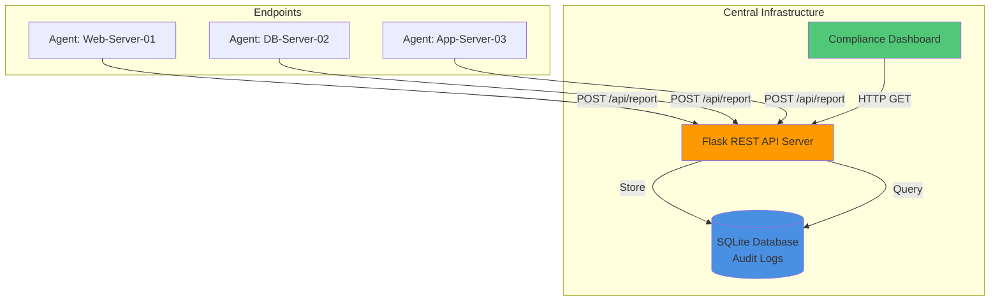

# 🛡️ OpenGRC: Continuous Compliance Monitoring System

<div align="center">


**Transform compliance from annual audits to real-time monitoring**

[Features](#-key-features) • [Installation](#-quick-start) • [Architecture](#-system-architecture) • [API Docs](#-api-documentation) • [Roadmap](#-roadmap)

</div>

---

## 📋 Overview

**OpenGRC** is an automated Governance, Risk, and Compliance (GRC) platform that modernizes compliance monitoring by shifting from traditional "point-in-time" audits to **continuous, real-time monitoring**.

Built on a distributed **client-server architecture**, OpenGRC deploys lightweight agents across endpoints to perform automated health checks (firewall status, password policies, etc.) and transmit compliance telemetry to a centralized dashboard via REST API.

### Why OpenGRC?

- ✅ **Real-time visibility** into your compliance posture
- ✅ **Automated evidence collection** for audit readiness
- ✅ **Historical audit trails** for forensic analysis
- ✅ **Scalable architecture** mimicking enterprise EDR solutions

---

## 📸 Live Dashboard


*The dashboard auto-refreshes every 5 seconds, providing live insights into infrastructure compliance status and historical trends.*

---

## 🏗️ System Architecture

OpenGRC implements a modern distributed monitoring architecture inspired by enterprise EDR (Endpoint Detection & Response) platforms.



### Core Components

| Component | File | Description |
|-----------|------|-------------|
| **Endpoint Agent** | `agent.py` | Lightweight Python script that validates system configurations against ISO 27001 controls and transmits findings via JSON payloads |
| **API Server** | `server.py` | Flask-based REST API that ingests telemetry, validates data integrity, and persists to database |
| **Database Layer** | `models.py` | SQLAlchemy ORM managing audit trails with timestamp indexing for historical analysis |
| **Web Dashboard** | `templates/` | Bootstrap 5 interface providing real-time compliance scoring and live event streaming |

---

## 🚀 Key Features

### 1. **Continuous Monitoring**
Unlike traditional annual audits, OpenGRC performs control validation every 10 seconds, providing immediate detection of configuration drift or security policy violations.

### 2. **RESTful API Telemetry**
Demonstrates industry-standard practices for secure data transmission:
- JSON-formatted payloads
- HTTP POST for stateless communication
- Schema validation on server-side

### 3. **Intelligent Compliance Scoring**
Real-time algorithmic calculation of compliance percentage based on:
```
Compliance Score = (Passed Checks / Total Checks) × 100%
```

### 4. **Immutable Audit Trail**
All control checks are persisted to SQL database with:
- Timestamp precision
- Hostname attribution
- Status tracking (PASS/FAIL/WARNING)
- Forensic-grade detail fields

---

## 🛠️ Technology Stack

| Layer | Technology | Purpose |
|-------|-----------|---------|
| **Backend** | Python 3.9+ | Core application logic |
| **Web Framework** | Flask 2.x | REST API & routing |
| **Database** | SQLite + SQLAlchemy | Persistent storage with ORM |
| **Networking** | Python `requests` + `socket` | HTTP client & system info |
| **Frontend** | HTML5 + Jinja2 + Bootstrap 5 | Responsive dashboard UI |

---

## 💻 Quick Start

### Prerequisites

```bash
# Check Python version (3.9+ required)
python --version

# Ensure pip is installed
pip --version
```

### Installation

**1. Clone the Repository**
```bash
git clone https://github.com/YOUR_USERNAME/OpenGRC-Lite.git
cd OpenGRC-Lite
```

**2. Install Dependencies**
```bash
pip install flask flask-sqlalchemy requests
```

**3. Launch the System**

Open **two terminal windows**:

**Terminal 1 – Start the Server:**
```bash
python server.py
```
Expected output:
```
 * Running on http://127.0.0.1:5000
 * Database initialized successfully
```

**Terminal 2 – Start the Agent:**
```bash
python agent.py
```
Expected output:
```
[+] Report sent: A.13.1 (Network Security) -> PASS
[+] Report sent: A.9.4.3 (Password Policy) -> PASS
```

**4. Access the Dashboard**

Open your browser and navigate to:
```
http://127.0.0.1:5000
```

---

## 🔍 API Documentation

### `POST /api/report`

Submit compliance check results from endpoint agents.

**Request Headers:**
```
Content-Type: application/json
```

**Request Body:**
```json
{
    "hostname": "Web-Server-01",
    "control_id": "A.13.1",
    "status": "PASS",
    "details": "Firewall active and filtering traffic on ports 80, 443"
}
```

**Response (Success):**
```json
{
    "status": "success",
    "message": "Report received",
    "timestamp": "2025-11-26T14:32:10Z"
}
```

**Status Codes:**
- `200` – Report accepted
- `400` – Invalid payload format
- `500` – Server error

---

## 🧠 ISO 27001 Controls Implemented

| Control ID | Name | Technical Implementation |
|------------|------|--------------------------|
| **A.13.1** | Network Security Management | Validates host firewall status (active/inactive) |
| **A.9.4.3** | Password Management System | Checks password complexity requirements (length, special chars) |

### Adding Custom Controls

Edit `agent.py` to include additional checks:

```python
def check_custom_control():
    # Your validation logic here
    return {
        "control_id": "A.X.X",
        "status": "PASS",  # or "FAIL"
        "details": "Custom check description"
    }
```

---

## 🔮 Roadmap

### Phase 1 – Security Enhancements
- [ ] **API Authentication**: Implement JWT tokens or API keys for agent-server communication
- [ ] **TLS Encryption**: Enforce HTTPS for all API traffic

### Phase 2 – Scalability
- [ ] **Multi-Agent Dashboard**: Filter and group by hostname, department, or geographic region
- [ ] **Database Migration**: Support PostgreSQL for enterprise deployments

### Phase 3 – Integrations
- [ ] **Alerting System**: Slack/Email notifications when compliance score drops below configurable threshold
- [ ] **SIEM Integration**: Export logs to Splunk/ELK stack
- [ ] **Compliance Reports**: Generate PDF audit reports (ISO 27001, SOC 2)

### Phase 4 – Advanced Features
- [ ] **Machine Learning**: Anomaly detection for unusual compliance patterns
- [ ] **Remediation Workflows**: Auto-trigger scripts when controls fail
- [ ] **Multi-Tenant Support**: Isolated environments for different business units

---

## 📚 Project Structure

```
OpenGRC-Lite/
├── agent.py              # Endpoint agent (client)
├── server.py             # Flask API server
├── models.py             # SQLAlchemy database models
├── templates/
│   └── dashboard.html    # Web interface
├── static/
│   └── styles.css        # Custom styling
├── assets/
│   └── dashboard.png     # Documentation screenshot
├── requirements.txt      # Python dependencies
├── README.md
└── LICENSE
```

---

## 🤝 Contributing

Contributions are welcome! Please follow these steps:

1. Fork the repository
2. Create a feature branch (`git checkout -b feature/AmazingFeature`)
3. Commit your changes (`git commit -m 'Add AmazingFeature'`)
4. Push to the branch (`git push origin feature/AmazingFeature`)
5. Open a Pull Request

---

## 📄 License

Distributed under the MIT License. See `LICENSE` file for more information.

---

## 👤 Contact

**Your Name**  
📧 Email: saadhan275@gmail.com.com  
---

## 🙏 Acknowledgments

- ISO/IEC 27001:2013 Information Security Standards
- Flask Framework Documentation
- Bootstrap Team for UI Components

---

<div align="center">

**⭐ Star this repository if you find it helpful!**

Made with ❤️ for the InfoSec & GRC Community

</div>